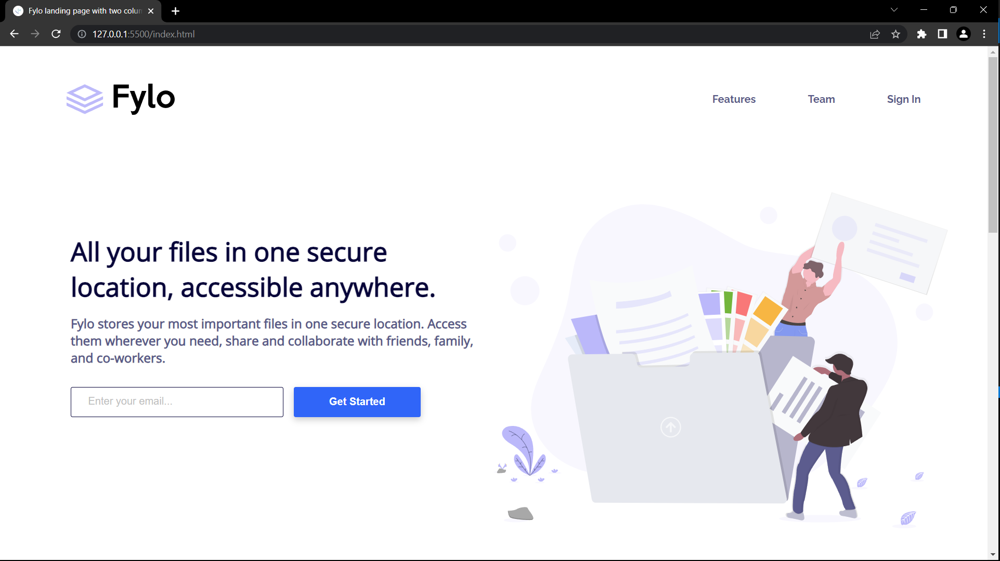

# Frontend Mentor - Fylo landing page with two column layout

This is a solution to the [Fylo landing page with two column layout challenge on Frontend Mentor](https://www.frontendmentor.io/challenges/fylo-landing-page-with-two-column-layout-5ca5ef041e82137ec91a50f5).

## Table of contents

- [Overview](#overview)
  - [Screenshot](#screenshot)
  - [Links](#links)
- [My process](#my-process)
  - [Built with](#built-with)
  - [What I learned](#what-i-learned)
  - [Useful resources](#useful-resources)
- [Author](#author)

## Overview

### The challenge

Users should be able to:

- See hover states for interactive elements

### Screenshot

### Links

- Solution URL: [Link](https://github.com/TJ-Shubham/fylo-landing-page-with-two-column-layout/)
- Live Site URL: [Link](https://tj-shubham.github.io/fylo-landing-page-with-two-column-layout/)

## My process

### Built with

- Semantic HTML5 markup
- CSS custom properties
- Flexbox
- Grid
- Used media query
- tailwaind css

### What I learned

Learn order properties. Understand the filter properties.

### Useful resources

- [filter](https://css-tricks.com/almanac/properties/f/filter/) - This helped me for coloring the logo. I really liked this pattern and will use it going forward.
- [order](https://css-tricks.com/almanac/properties/o/order/) - This is an amazing article which helped me finally understand order. I'd recommend it to anyone still learning this concept.

## Author

- Website - [Shubham](https://github.com/TJ-Shubham)
